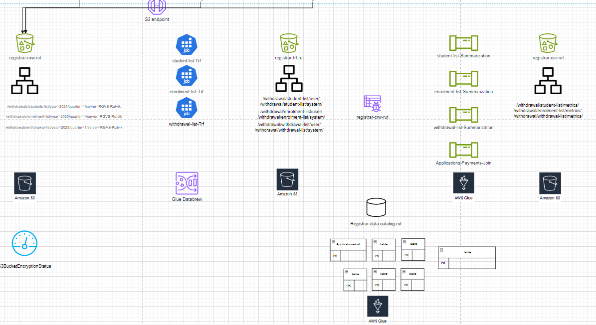
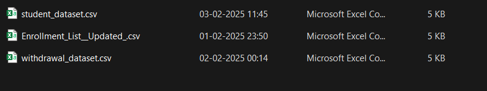

# cloud-computing-project
# Descriptive Analysis - Project 1
# Project Description: Descriptive Analysis of Enrolment and Withdrawal policy data at UCW
# Project Title: Design and Deployment of a Scalable Data Analytics Platform (DAP) using AWS
- Objective: The purpose of this project is to develop a scalable Data Analytics Platform (DAP) using AWS cloud services. The platform is designed to handle the complete data lifecycle, including ingestion, transformation, storage, querying, and quality control, for operational datasets. This infrastructure supports effective data management and analytical insights for informed decision-making.
# Dataset:The project involves the ingestion and processing of three operational datasets:

- **Student List**: Contains the list of registered students and their demographic or program details.
- **Enrolment List**: Includes records of courses enrolled by students during a specific academic term.
- **Withdrawal List**: Captures student withdrawals from courses or programs, including reasons and timestamps.

# Methodology:
# Steps
# 1- Data Collection and Preparation:
- Load the dataset using data analysis tools (Excel) .
- Perform data cleaning to address missing values, correct data types, and remove duplicates.
# 2- Descriptive Statistics: 
This section should summarize key statistics using data stored in the S3 bucket “ registrar-__-rut “ in its different stages (raw,trf,curated) and processed via an ETL pipeline.
# Raw Bucket (S3 Bucket - Raw Folder):
- Upload the original dataset.
- The dataset should contain raw data about incidents such as the incident student ID, name, major, enrolment year, GPA etc.
# Transformed bucket (S3 Bucket - trf Folder):
- After the AWS Glue data brew processes the data from the raw bucket, store the cleaned data (with corrected data types, missing values addressed, and duplicates removed) here.
# Curated bucket (S3 Bucket - Curated Folder):
- After completing the transformations and aggregations, store the final summarized data of AWS ETL pipeline  data set stored here.
- The data here should include cleaned and processed insights ready for analysis and visualization.

# 3- Data Visualization: 
- In this section, use Draw.io for visualizing data insights , for visualizations created based on the curated data in the S3 bucket after ETL processing.
# 4- Recommendations: 
- Prioritize departments with high withdrawal rates for targeted academic support.
- Monitor enrolment trends to optimize course offerings.
- Use curated insights to enhance retention strategies and improve student experience.
- Implement regular data reviews for continuous academic planning.
# Tools and Technologies:
- Excel , AWS Services, S3 bucket
- Data visualization tools : Draw.io ,ETL pipeline
# Deliverables:
- A detailed report summarizing the methods, findings, and recommendations.
- Visualizations and dashboards to present key insights clearly.
- Data quality reports for each dataset
# This descriptive analysis project aims to provide a comprehensive understanding of student enrolment and withdrawal patterns at UCW and to support data-driven improvements in academic planning, student retention strategies, and program offerings across departments.
- Screen shot 1 : Operational environment analysis and Data analytics Platform 

- Screen shot 2 : Descriptive data set under operational environment

- Screen shot 3 : Descriptive data set under Analytical environment (S3 Bucket)
.png)
- Screen shot 4 : Draw.io pipeline workings - Inspection completed rate visualization

- Screen shot 5 : ETL Pipeline for inspection data set

- Screen shot 6 : Data stored under curated folder in S3 bucket

# Data Wrangling - Project 2
# Project Title: Data Wrangling for Enhanced Occupational Health and Safety Analytics at UCW
# Objective:
- The primary goal of this project is to perform comprehensive data wrangling to prepare a robust dataset for occupational health and safety analytics at UCW. By cleaning, transforming, and consolidating data from various inspection reports and safety logs, the project aims to enhance the accuracy and usability of safety-related data for subsequent analysis and reporting. This will help in identifying trends, mitigating risks, and improving workplace safety protocols.
# Background:
- UCW has accumulated inspection data from multiple departments regarding occupational health and safety incidents. However, this data is often inconsistent, incomplete, or fragmented, making it difficult to derive actionable insights. Effective data wrangling will enable UCW to make informed decisions and develop targeted safety strategies to reduce workplace risks and incidents.
# Dataset: The data wrangling process will involve various datasets, including:
- Incident Reports: Records of workplace incidents, including unique incident IDs, dates, departments, issues, severity levels, and current status.
- Safety Logs: Details of safety inspections, actions taken, and follow-up measures.
- Department Information: Metadata about UCW departments, including department names and headcounts.
# Methodology:
# 1.Data Collection:
- Gather datasets from various sources (inspection reports, safety logs) and import them into AWS S3 for storage
- Use AWS Glue to catalog the datasets, including details like incident ID, date, department, issue, severity, and status, creating a metadata repository for easy data discovery and management.
# 2.Data Assessment:
- Utilize AWS Glue DataBrew to perform an initial assessment of the inspection report data. This includes identifying missing values, duplicates, and inconsistencies (e.g., discrepancies in incident dates or severity ratings).
- Use DataBrew profiling tools to document data types, formats (e.g., date formats), and any issues across datasets.
# 3.Data Cleaning:
- Leverage AWS Glue DataBrew to address missing values in inspection reports, either by imputation or exclusion depending on the data's context (e.g., missing incident descriptions or incomplete actions).
- Standardize formats for fields such as dates, department names, and severity levels (e.g., “low,” “medium,” “high”) using DataBrew transformations.
- Remove duplicate entries for incidents and normalize categorical variables like incident status ("resolved," "pending," etc.).
# 5.Data Consolidation:
- Set up AWS glue data brew consolidate datasets into S3 bucket (in raw folders)
- Set up AWS Glue ETL jobs to consolidate datasets and store the consolidated data in S3 (in curated folders) for future analytics and reporting, providing a unified view of health and safety data.
# 6.Documentation and Validation:
- Document the data wrangling process using AWS Glue’s catalog features, detailing data sources, cleaning methods, and transformations applied to the occupational health and safety data.
- Validate the final dataset through exploratory analysis using AWS Athena to ensure the data is complete and accurate, ready for insights into workplace safety trends, departmental performance, and incident resolution effectiveness.
# Tools and Technologies:
- AWS Glue and AWS Glue DataBrew for data cleaning, transformation, and ETL.
- AWS Athena for querying and performing analysis on structured datasets in S3.
# Deliverables:
-	A cleaned and transformed customer dataset ready for analysis, available in a suitable format (e.g., CSV, Excel Database).
-	A comprehensive report documenting the data wrangling process, including challenges encountered, methods employed, and final dataset characteristics.
-	Visualizations illustrating the key data insights and confirmations of data quality checks were conducted during the process.
#	Timeline:
- Expected completion of the project: 6 weeks, including phases for assessment, cleaning, transformation, and documentation.
  This modified project description ensures that the project objectives and datasets align with the HR-Occupational Health and Safety domain and UCW's inspection report analysis.
# Screen shots
- DAP from Draw.io 
- AWS Glue data brew cleaning and structuring data 
- Projects created 
- Atheena platforms data cleaning and structuring 

  
# Data Quality Control  - Project 3
# Project Description:
- Data Quality Control Initiative for Occupational Health and Safety Inspection Data at UCW
# Project Title:
- Implementation of Data Quality Control Measures for Occupational Health and Safety at UCW
# Objective:
- The primary objective of this project is to establish a comprehensive Data Quality Control (DQC) framework for Occupational Health and Safety (OHS) inspection data at UCW. This framework will ensure the accuracy, completeness, consistency, and security of OHS inspection data, supporting safety improvements, compliance with regulatory standards, and risk mitigation.
# Background:
- UCW has accumulated a large volume of inspection data related to occupational health and safety incidents across various departments. Issues such as inaccuracies, incomplete reports, and inconsistencies in formats have emerged. These data quality issues could impact decision-making and UCW’s ability to maintain a safe working environment. This project aims to implement robust data quality control measures using AWS services to address these challenges.
# Scope:
The project will focus on the following key areas:
-	Data Profiling: Analyzing existing inspection datasets to assess quality levels.
-	Data Cleansing: Developing processes to correct inaccuracies and standardize formats.
-	Data Validation: Implementing validation rules and checks to ensure data integrity.
-	Monitoring and Reporting: Establishing real-time monitoring and dashboards to track data quality metrics using AWS services.
-	Security and Compliance: Ensuring data security and regulatory compliance using AWS security services.
-	Training and Awareness: Creating training programs for staff on maintaining data quality.
# Methodology:
# 1.Current State Assessment:
-Conduct a thorough analysis of current OHS data sources (e.g., inspection reports, incident logs) and workflows.
Identify key datasets that significantly impact UCW’s compliance with safety standards and regulations.
# 2.Data Profiling:
- Use AWS Glue , ETL to profile OHS datasets, assessing the completeness, validity, and consistency of inspection records
- Document findings, highlighting areas where data quality issues exist (e.g., missing fields in incident descriptions, inconsistent severity ratings).
# 3.Establish Data Quality Metrics:
-	Define clear data quality metrics such as error rates, completeness percentages, duplicate records, and compliance with safety standards.
-	Track these metrics using AWS CloudWatch for real-time monitoring and alerting of data quality trends.
# 4.Validation Rules and Procedures:
-	Set up validation rules using AWS Glue to ensure new data entries adhere to defined quality standards before they are processed.
-	Implement data entry guidelines, stored in S3 (trusted folder), to promote consistency and accuracy in future inspections.
-	Use AWS Glue Workflow to automate the entire data quality control process, orchestrating the tasks in a logical sequence, including data profiling, cleansing, validation, and consolidation.
-	The workflow will trigger each step automatically, ensuring that the data quality processes are efficiently managed and minimizing manual intervention.
-	AWS Glue Workflow will also monitor the completion of each task and trigger notifications in AWS CloudWatch for real-time tracking and alerting if any steps fail.
# Monitoring and Reporting:
-	Utilize AWS CloudWatch to monitor key data quality metrics in real-time, setting alerts for significant deviations from established KPIs (e.g., sudden spikes in missing values or inconsistencies).
-	Create a CloudWatch dashboard for visualizing data quality trends and performance.
-	Use AWS CloudTrail for tracking changes to the data environment, ensuring full auditability of data quality issues and resolution steps.
# 6.Security and Compliance:
-	Use AWS IAM for role-based access control, ensuring only authorized personnel can modify or validate inspection data.
-	Encrypt sensitive inspection data using AWS KMS to maintain data confidentiality and compliance with data security regulations.
# 7.Training and Best Practices:
-	Develop training resources and workshops to educate UCW staff on data quality best practices, ensuring data integrity in future inspections.
-	Establish a culture of accountability where employees understand their role in maintaining data quality and security.
# 8.Feedback Mechanism:
-	Implement a feedback loop for continuous improvement of the data quality control process based on real-time monitoring and user input.
# Tools and Technologies:
-	AWS Glue for data profiling, cleansing, and transformation.
-	AWS Glue Workflow for orchestrating the data quality process.
-	AWS CloudWatch for real-time monitoring and alerting of data quality metrics.
-	AWS CloudTrail for tracking and auditing changes in data environments.
-	AWS IAM for secure role-based access control.
-	AWS KMS for encryption of sensitive data.
# Deliverables:
•	A comprehensive Data Quality Control Plan outlining processes, metrics, and responsibilities.
•	Documentation of data quality metrics and KPIs being tracked.
•	Cleaned and validated OHS datasets ready for reporting and analysis.
•	Training materials and workshops designed to educate staff on data quality best practices.
•	A CloudWatch dashboard visualizing real-time data quality metrics.
# Timeline:
-	Expected completion of the project: 8 weeks, including assessment, implementation, training, and monitoring setup.
This initiative will empower UCW to enhance the integrity, reliability, and security of its Occupational Health and Safety data, resulting in better decision-making, improved safety outcomes, and compliance with regulatory requirements.
# Screen shots
- DAP platform in Draw.io 
- AWS glue data cleaning for quality 
- Storing data in trusted folder in S3 bucket 
- AWS Glue workflow 
- AWS cloud watch 
- AWS cloud trail 
- AWS KMS creation for data encryption 

