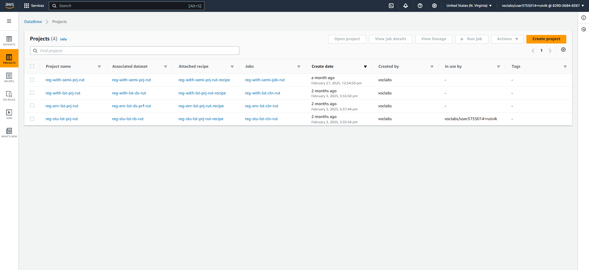
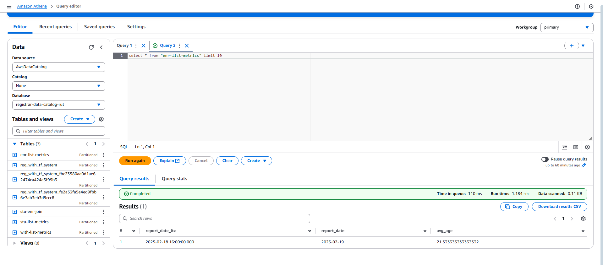
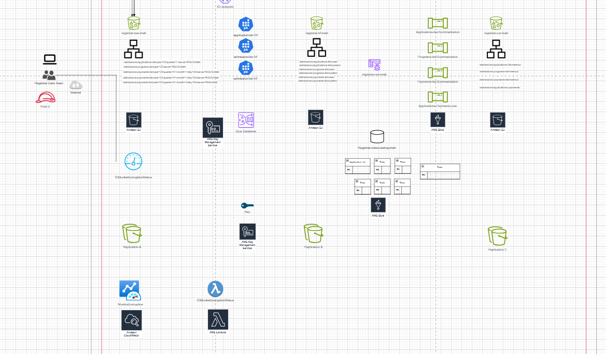
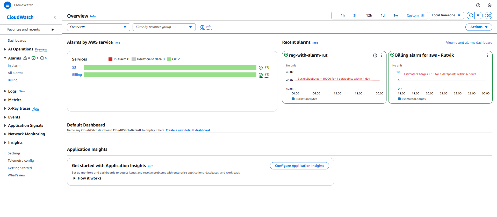
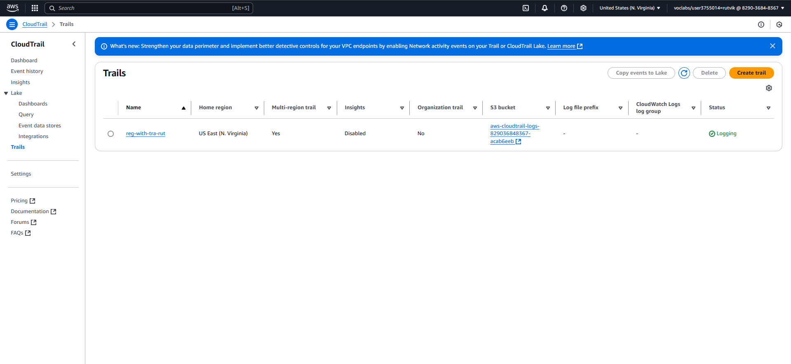
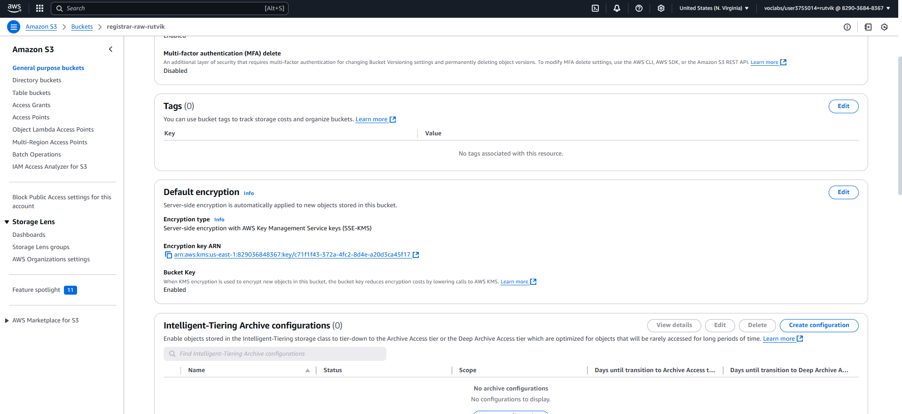

# cloud-computing-project
# Descriptive Analysis - Project 1
# Project Description: Descriptive Analysis of Enrolment and Withdrawal policy data at UCW
# Project Title: Design and Deployment of a Scalable Data Analytics Platform (DAP) using AWS
- Objective: The purpose of this project is to develop a scalable Data Analytics Platform (DAP) using AWS cloud services. The platform is designed to handle the complete data lifecycle, including ingestion, transformation, storage, querying, and quality control, for operational datasets. This infrastructure supports effective data management and analytical insights for informed decision-making.
# Dataset:The project involves the ingestion and processing of three operational datasets:

- **Student List**: Contains the list of registered students and their demographic or program details.
- **Enrolment List**: Includes records of courses enrolled by students during a specific academic term.
- **Withdrawal List**: Captures student withdrawals from courses or programs, including reasons and timestamps.

# Methodology:
# Steps
# 1- Data Collection and Preparation:
- Load the dataset using data analysis tools (Excel) .
- Perform data cleaning to address missing values, correct data types, and remove duplicates.
# 2- Descriptive Statistics: 
This section should summarize key statistics using data stored in the S3 bucket “ registrar-__-rut “ in its different stages (raw,trf,curated) and processed via an ETL pipeline.
# Raw Bucket (S3 Bucket - Raw Folder):
- Upload the original dataset.
- The dataset should contain raw data about incidents such as the incident student ID, name, major, enrolment year, GPA etc.
# Transformed bucket (S3 Bucket - trf Folder):
- After the AWS Glue data brew processes the data from the raw bucket, store the cleaned data (with corrected data types, missing values addressed, and duplicates removed) here.
# Curated bucket (S3 Bucket - Curated Folder):
- After completing the transformations and aggregations, store the final summarized data of AWS ETL pipeline  data set stored here.
- The data here should include cleaned and processed insights ready for analysis and visualization.

# 3- Data Visualization: 
- In this section, use Draw.io for visualizing data insights , for visualizations created based on the curated data in the S3 bucket after ETL processing.
# 4- Recommendations: 
- Prioritize departments with high withdrawal rates for targeted academic support.
- Monitor enrolment trends to optimize course offerings.
- Use curated insights to enhance retention strategies and improve student experience.
- Implement regular data reviews for continuous academic planning.
# Tools and Technologies:
- Excel , AWS Services, S3 bucket
- Data visualization tools : Draw.io ,ETL pipeline
# Deliverables:
- A detailed report summarizing the methods, findings, and recommendations.
- Visualizations and dashboards to present key insights clearly.
- Data quality reports for each dataset
# This descriptive analysis project aims to provide a comprehensive understanding of student enrolment and withdrawal patterns at UCW and to support data-driven improvements in academic planning, student retention strategies, and program offerings across departments.
- Screen shot 1 : Operational environment analysis and Data analytics Platform 

- Screen shot 2 : Descriptive data set under operational environment

- Screen shot 3 : Descriptive data set under Analytical environment (S3 Bucket)

-- Screen shot 5 : ETL Pipeline for inspection data set

- Screen shot 6 : Data stored under curated folder in S3 bucket

# Data Wrangling - Project 2
### Project Description:
This section of the project addresses the cleaning and preparation of institutional data required for analysis. The data wrangling process ensures that the datasets are accurate, consistent, and ready for downstream analytics.
# Project Title: Data Wrangling of Student Enrolment and Withdrawal Datasets at UCW
### Objective:
The objective is to perform structured data wrangling tasks to transform three source datasets into a unified and cleaned format. The process involves addressing missing values, data type inconsistencies, and formatting issues.
### Background:
Initial data collected from academic records contained inconsistencies, such as irregular date formats, missing values, and non-standardized column labels. Data wrangling was required to align records across student, enrolment, and withdrawal datasets.
# Dataset: The data wrangling process will involve various datasets, including:
### Dataset:

- `student_dataset.csv`  
  Columns: `Student_ID`, `Student_Name`, `Email`, `Program`, `Level`, `Status`

- `Enrollment_List__Updated_.csv`  
  Columns: `Student_ID`, `Course_Code`, `Course_Name`, `Enrolment_Date`, `Term`, `Status`

- `withdrawal_dataset.csv`  
  Columns: `Student_ID`, `Course_Code`, `Withdrawal_Date`, `Reason`, `Status`
  
# Methodology:
### Methodology:
1. **Data Profiling**  
   AWS Glue DataBrew profiling tools were used to assess data quality by identifying nulls, incorrect types, and duplicate rows.
2. **Data Cleaning**  
   - Renamed all column headers across datasets for consistency by converting them to lowercase and replacing spaces with underscores (e.g., `Student Name` → `student_name`), ensuring 
     uniform schema across files.
   - Removed duplicate records
   - Resolved missing or incomplete entries
3. **Data Transformation and Storage**  
   Transformed datasets were stored in the S3 Transformed Bucket. Final datasets were written to the S3 Curated Bucket.
# Tools and Technologies:
- AWS Glue and AWS Glue DataBrew for data cleaning, transformation, and ETL.
- AWS Athena for querying and performing analysis on structured datasets in S3.
# Deliverables:
-	A cleaned and transformed customer dataset ready for analysis, available in a suitable format (e.g., CSV, Excel Database).
-	A comprehensive report documenting the data wrangling process, including challenges encountered, methods employed, and final dataset characteristics.
-	Visualizations illustrating the key data insights and confirmations of data quality checks were conducted during the process.
#	Timeline:
- Expected completion of the project: 6 weeks, including phases for assessment, cleaning, transformation, and documentation.
# Screen shots
- AWS Glue data brew cleaning and structuring data !
- Projects created 
- Atheena platforms data cleaning and structuring 

  
# Data Quality Control  - Project 3
### Project Description:
This section introduces a framework to ensure the quality of student-related datasets processed through the Data Analytics Platform. Quality control steps include profiling, validation, and lifecycle management using AWS services.
### Project Title:
Data Quality Control for Academic Records at UCW
### Objective:
To design and implement a data quality control process for the student, enrolment, and withdrawal datasets. The goal is to ensure the final datasets meet standards of accuracy, completeness, and consistency.
### Background:
UCW maintains large volumes of student-related data, including enrolment records, withdrawal details, and academic status across multiple terms. However, inconsistencies such as missing values, irregular formatting, and duplication were observed during earlier analysis stages. These data quality issues can hinder accurate reporting, policy decisions, and academic planning. This project focuses on establishing a structured data quality control framework using AWS services to ensure data integrity, consistency, and reliability across curated datasets.
### Scope:
The project focuses on the following key areas:
- **Data Profiling**: Analyzing student enrolment, withdrawal, and academic datasets to assess baseline data quality.
- **Data Cleansing**: Applying structured cleaning steps to resolve missing values, standardize column formats, and eliminate duplicates.
- **Data Validation**: Defining and enforcing validation rules to ensure consistency in student records across datasets.
- **Monitoring and Reporting**: Using AWS tools to review data quality metrics, identify recurring issues, and support academic reporting needs.
- **Security and Compliance**: Managing access, encryption, and data lifecycle policies to ensure privacy and compliance with institutional standards.
- **Documentation and Awareness**: Documenting quality control processes and promoting best practices for future academic data handling.
  
### Methodology:

#### 1. Current State Assessment:
- Conduct a detailed review of existing student-related datasets, including enrolment records, withdrawal logs, and academic status files.
- Identify key quality issues such as inconsistent column naming, missing values, and data duplication that may impact analytics and academic reporting.

#### 2. Data Profiling:
- Use AWS Glue DataBrew and ETL jobs to profile the datasets and assess completeness, validity, and structural consistency.
- Document profiling results, highlighting common issues like null entries in critical fields (e.g., course codes, withdrawal dates) or misaligned formats.

#### 3. Establish Data Quality Metrics:
- Define quantifiable quality metrics such as null value percentages, duplicate records, data type mismatches, and formatting consistency.
- Monitor these metrics using AWS Glue Data Quality or AWS CloudWatch to detect and alert on anomalies.

#### 4. Validation Rules and Procedures:
- Establish validation rules within AWS Glue to ensure data conforms to academic structure and business logic (e.g., valid course codes, non-future withdrawal dates).
- Store standardized input schemas in S3 (trusted zone) to guide future data uploads.
- Use a structured ETL pipeline to orchestrate the profiling, cleaning, and validation process sequentially, ensuring minimal manual handling.

#### 5. Monitoring and Reporting:
- Use AWS CloudWatch to monitor data quality metrics in real-time and configure alerts for deviations from predefined thresholds (e.g., >10% null values).
- Generate and maintain dashboards visualizing data trends and issue frequency.
- Track changes to datasets and quality pipelines using AWS CloudTrail for full traceability and auditing.

#### 6. Security and Compliance:
- Enforce access controls using AWS IAM to restrict editing privileges to authorized users only.
- Apply AWS KMS to encrypt sensitive student information, maintaining confidentiality and compliance with institutional data governance standards.

#### 7. Training and Best Practices:
- Develop internal documentation and user guidelines on maintaining data quality during uploads and transformations.
- Encourage best practices through staff awareness, fostering responsibility for consistent data handling.

#### 8. Feedback Mechanism:
- Implement a feedback loop using monitored quality trends and manual review outcomes to continuously refine data rules and processing logic.
- Use recurring validation reports to adapt the data quality framework to future academic needs.

# Tools and Technologies:
-	AWS Glue for data profiling, cleansing, and transformation.
-	AWS Glue Workflow for orchestrating the data quality process.
-	AWS CloudWatch for real-time monitoring and alerting of data quality metrics.
-	AWS CloudTrail for tracking and auditing changes in data environments.
-	AWS IAM for secure role-based access control.
-	AWS KMS for encryption of sensitive data.
# Deliverables:
•	A comprehensive Data Quality Control Plan outlining processes, metrics, and responsibilities.
•	Documentation of data quality metrics and KPIs being tracked.
•	Cleaned and validated OHS datasets ready for reporting and analysis.
•	Training materials and workshops designed to educate staff on data quality best practices.
•	A CloudWatch dashboard visualizing real-time data quality metrics.
### Timeline:
- Week 5: Data quality profiling and rule setup
- Week 6: Validation, lifecycle policy configuration, and reporting
This initiative will empower UCW to enhance the integrity, reliability, and consistency of its academic datasets, resulting in more accurate reporting, improved student services, and data-driven academic decision-making.
# Screen shots
- DAP platform in Draw.io 
- AWS cloud watch 
- AWS cloud trail 
- AWS KMS creation for data encryption 

